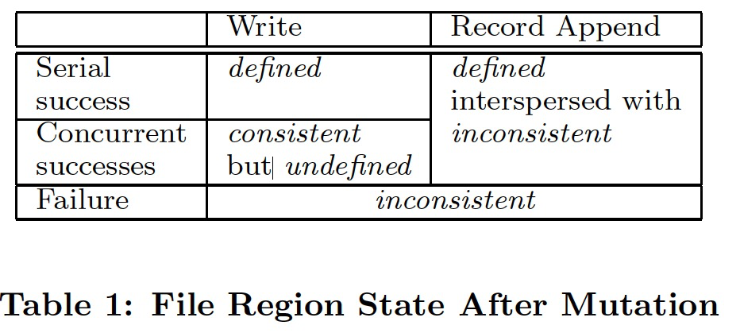
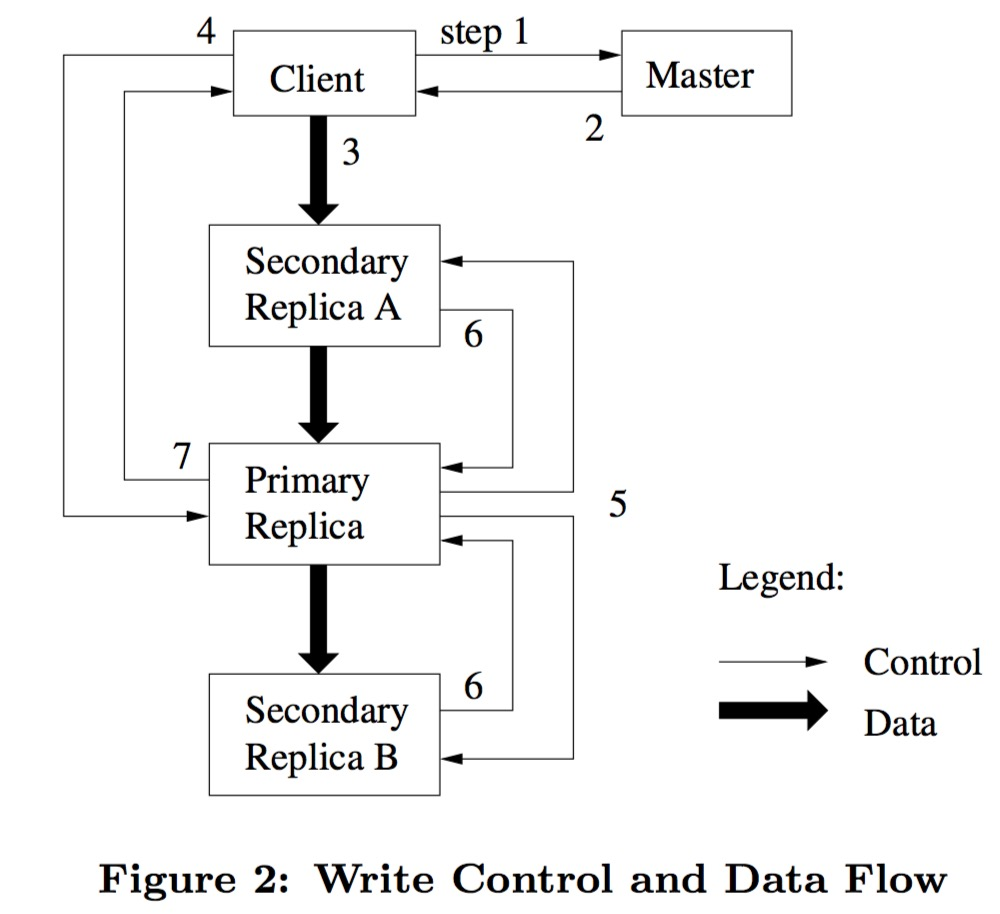

[The Google File System](./gfs.pdf)

**主要章节的翻译**

- [摘要](#摘要)
- [介绍](#1-介绍)
- [设计概览](#2-设计概览)
	- [假设](#21-假设)
	- [接口](#22-接口)
	- [架构](#23-架构)
	- [单点Master](#24-单点Master)
	- [块尺寸](#25-块尺寸)
	- [元数据](#26-元数据)
		- [内存中数据结构](#261-内存中数据结构)
		- [块位置](#262-块位置)
		- [操作日志](#263-操作日志)
	- [一致性模型](#27-一致性模型)
		- [GFS的承诺](#271-GFS的承诺)
		- [对用户应用的影响](#272-对用户应用的影响)
- [系统交互](#3-系统交互)
	- [租约和修改顺序](#31-租约和修改顺序)
	- [数据流](#32-数据流)
	- [原子纪录增加](#33-原子纪录增加)
- [主节点操作](#4-主节点操作)
	- [命名空间管理和锁](#41-命名空间管理和锁)
	- [副本放置](#42-副本放置)
	- [创建、重复制、重负载均衡](#43-创建、重复制、重负载均衡)
	- [垃圾回收](#44-垃圾回收)
		- [机制](#441-机制)
		- [讨论](#442-讨论)
	- [旧副本侦测](#45-旧副本侦测)
- [容错和诊断](#5-容错和诊断)
	- [高可用](#51-高可用)
		- [快速恢复](#511-快速恢复)
		- [chunk复制](#512-chunk复制)
		- [master复制](#513-master的复制)
	- [数据完整性](#52-数据完整性)
	- [诊断工具](#53-诊断工具)

## 摘要

&emsp;&emsp;我们已经设计和实现了Google File System，一个适用于大规模分布式数据处理相关应用的，可扩展的分布式文件系统。它基于普通的不算昂贵的硬件设备，实现了容错的设计，并且为大量客户端提供极高的聚合处理性能。 

&emsp;&emsp;我们的设计目标和上一个版本的分布式文件系统有很多相同的地方，我们的设计是依据我们应用的工作量以及技术环境来设计的，包括现在和预期的，都有一部分和早先的文件系统的约定有所不同。这就要求我们重新审视传统的设计选择，以及探索究极的设计要点。 

&emsp;&emsp;这个文件系统正好与我们的存储要求相匹配。这个文件系统在Google内部广泛应用于作为存储平台使用，适用于我们的服务要求产生和处理数据应用，以及我们的研发要求的海量数据的要求。最大的集群通过上千个计算机的数千个硬盘，提供了数百TB的存储，并且这些数据被数百个客户端并行同时操作。 

&emsp;&emsp;在这个论文里，我们展示了用于支持分布式应用的扩展文件系统接口设计，讨论了许多我们设计的方面，并且列出了我们的micro-benchmarks以及真实应用性能指标。

## 1 介绍

&emsp;&emsp;我们已经为Google迅速增长的数据处理需要而设计和实现了Google File System(GFS)。GFS和上一个分布式文件系统有着很多相同的设计目标，比如性能，扩展性，可靠性，以及可用性。不过，他的设计是基于我们应用的工作量和技术环境驱动的，包括现在和预期的，都有部分和上一个版本的约定有点不同。这就要求我们重新审视传统的设计选择，以及探索究极的设计要点。

- 首先，节点失效将被看成是正常情况，而不再视为异常情况。整个文件系统包含了几百个或者几千个由廉价的普通机器组成的存储机器，而且这些机器是被与之匹配数量的客户端机器访问。这些节点的质量和数量都实际上都确定了在任意给定时间上，一定有一些会处于失效状态，并且某一些并不会从当前失效中恢复回来。这有可能由于程序的bug，操作系统的bug，人工操作的失误，以及硬盘坏掉，内存，网络，插板的损坏，电源的坏掉等等。因此，持续监视，错误检测，容错处理，自动恢复必须集成到这个文件系统的设计中来。

- 其次，按照传统标准来看，文件都是非常巨大的。数个GB的文件是常事。每一个文件都包含了很多应用程序对象，比如web文档等等。当我们通常操作迅速增长的，由很多TB组成的，包含数十亿对象的数据集，我们可不希望管理数十亿个KB大小的文件，即使文件系统能支持也不希望。所以，设计约定和设计参数比如I/O操作以及blocksize（块大小），都需要重新审查。

- 第三，大部分文件都是只会在文件尾新增加数据，而少见修改已有数据的。对一个文件的随机写操作在实际上几乎是不存在的。当一旦写完，文件就是只读的，并且一般都是顺序读取得。多种数据都是有这样的特性的。有些数据可能组成很大的数据仓库，并且数据分析程序从头扫描到尾。有些可能是运行应用而不断的产生的数据流。有些是归档的数据。有些是一个机器为另一个机器产生的中间结果，另一个机器及时或者随后处理这些中间结果。对于这些巨型文件的访问模式来说，增加模式是最重要的，所以我们首要优化性能的以及原子操作保证的就是它，而在客户端cache数据块没有什么价值。

- 第四，与应用一起设计的的文件系统API对于增加整个系统的弹性适用性有很大的好处。例如我们放松了GFS一致性模型的需求，从而我们不用部署复杂的应用系统就可以把GFS应用到大量的简单文件系统基础上。我们也引入了原子的增加操作，这样可以让多个客户端同时操作一个文件，而不需要他们之间有额外的同步操作。这些在本论文的后边章节有描述。 
多个GFS集群现在是作为不同应用目的部署的。最大的一个有超过1000个存储节点，超过300TB的硬盘存储，并且负担了持续沉重的上百个在不同机器上的客户端的访问。

## 2 设计概览

### 2.1 假设

&emsp;&emsp;设计GFS过程中我们做了很多的设计假设，它们既意味着挑战，也带来了机遇。我们早先提到的关于观测到的关键要点，现在我们详细描述下这些假设。

- 系统是构建在很多廉价的、普通的计算机上，这些计算机经常故障。它必须不间断监控自己、侦测错误，能够容错和快速恢复。

- 系统存储了大量的超大文件。我们预期有好几百万个文件，每一个超过100MB。数GB的文件经常出现并且应当对大文件进行有效的管理。同时必须支持小型文件，但是我们不必为小型文件进行特别的优化。

- 一般的工作量都是由两类读取组成：大的流式读取和小规模的随机读取。在大的流式读取中，每个读操作通常要读取几百k的数据，读取1M或者以上的数据也很常见。相同客户端发起的连续操作通常是在一个文件读取一个连续的范围。小规模的随机读取通常在文件的不同位置，读取几k数据。重视性能的应用程序通常会将它们的小型读批量打包、组织排序，能显著的提升性能。

- 工作量也来自对大型的、连续的写操作，即将数据append到文件。append数据的大小与一次读操作差不多。一旦完成写入，文件就很少会更改。对于文件的随机小规模写入是要被支持的，但是不需要为此作特别的优化。

- 系统必须非常有效的，明确细节的对多客户端并行添加同一个文件进行支持。我们的文件经常使用生产者/消费者队列模式，或者作为多路合并模式进行操作。几百个机器运行的制造者，将并发的append到一个文件。用最小的同步代价实现原子性是关键所在。文件被append时也可能出现并发的读。

- 高性能的稳定带宽的网络要比低延时更加重要。我们的目标应用程序一般会大量操作处理比较大块的数据，并且很少有应用要求某个读取或者写入要有一个很短的响应时间。

### 2.2 接口

&emsp;&emsp;GFS提供了常见的文件系统的接口，虽然他没有实现一些标准的API比如POSIX。文件是通过pathname来通过目录进行分层管理的。我们支持的一些常见操作：create,delete,open,close,read，write等文件操作。 
&emsp;&emsp;另外，GFS还提供snapshot和record append操作。snapshot可以用很低的花费为一个文件或者整个目录树创建一个副本。record append允许多个客户端并发的append数据到同一个文件，而且保证它们的原子性。这对于实现多路合并、生产者/消费者队列非常有用，大量的客户端能同时的append，也不用要考虑锁等同步问题。这种文件对于构造大型分布式应用来说，是不可或缺的。snapshot 和record append在后边的3.4 和3.3节有单独讲述。

### 2.3 架构

&emsp;&emsp;一个GFS集群包含单个master和多个chunkserver，被多个客户端访问，如图1所示。图中各组件都是某台普通Linux机器上运行在用户级别的一个进程。只要机器资源允许，并且允许不稳定的应用代码导致的低可靠性，我们就可以运行chunkserver和client可以运行在同一个机器上。 

&emsp;&emsp;在GFS下，每一个文件都拆成固定大小的chunk(块)。每一个块都由master根据块创建的时间产生一个全局唯一的以后不会改变的64位的chunk handle标志。chunkservers在本地磁盘上用Linux文件系统保存这些块，并且根据chunk handle和字节区间，通过linux文件系统读写这些块的数据。出于可靠性的考虑，每一个块都会在不同的chunkserver上保存备份。缺省情况下，我们保存3个备份，用户能为不同命名空间的文件配置不同的复制级别。

&emsp;&emsp;master负责管理所有的文件系统的元数据。包括namespace，访问控制信息，文件到chunk的映射关系，当前chunk的位置等等信息。master也同样控制系统级别的活动，比如chunk的分配管理，孤点chunk的垃圾回收机制，以及chunkserver之间的chunk迁移。master和这些chunkserver之间会有定期的心跳线进行通讯，并且心跳线传递信息和chunckserver的状态。 

&emsp;&emsp;每个应用程序会引用GFS的客户端API，此API与正规文件系统API相似，并且负责与master和chunkserver通讯，基于应用的行为来读写数据。客户端只在获取元数据时与master交互，真实的数据操作会直接发至chunkserver。我们并没有提供POSIX API并且不需要和Linux的vnode层相关。 

&emsp;&emsp;客户端或者chunkserver都不会cache文件数据。客户端缓存文件数据收益很小，这是因为大部分的应用都是流式访问超大文件或者操作的数据集太大而不能被chache。不设计cache系统使得客户端以及整个系统都大大简化了（少了cache的同步机制）(但是客户端会缓存元数据。)。chunkserver不需要cache文件数据，因为chunks就像本地文件一样的被保存，所以Linux的buffer cache已经把常用的数据cache到了内存里。

### 2.4 单点Master

&emsp;&emsp;单一master大大的简化了我们的设计，单一master能够放心使用全局策略执行复杂的chunk布置、制定复制决策等。然而，我们必须在读写过程中尽量减少对它的依赖，它才不会成为一个瓶颈。客户端从不通过master读写文件，它只会询问master自己应该访问哪个chunkserver。客户端会缓存这个信息一段时间，随后的很多操作即可以复用此缓存，与chunkserver直接交互。

&emsp;&emsp;我们利用图1来展示一个简单读操作的交互过程。首先，使用固定的chunk size，客户端将应用程序指定的文件名和字节偏移量翻译为一个GFS文件及内部chunk序号，随后将它们作为参数，发送请求到master。master找到对应的chunk句柄和副本位置，回复给客户端。客户端缓存这些信息，使用GFS文件名+chunk序号作为key。

&emsp;&emsp;于是这个客户端就像对应的位置的chunkserver发起请求，通常这个会是离这个客户端最近的一个。请求给定了chunk handle以及一个在这个chunk内需要读取得字节区间。在这个chunk内，再次操作数据将不用再通过客户端与master的交互，除非这个客户端本身的cache信息过期了，或者这个文件重新打开了。实际上，客户端通常都会在请求中附加向master询问多个chunk的信息，master于是接着会立刻给这个客户端回应这些chunk的信息。这个附加信息是通过几个几乎没有任何代价的客户端与master的交互完成的。

### 2.5 块尺寸

&emsp;&emsp;chunk的大小是一个设计的关键参数。我们选择这个大小为64M，远远大于典型的文件系统的block大小。每一个chunk的实例（复制品）都是作为在chunkserver上的Linux文件格式存放的，并且只有当需要的情况下才会增长。懒惰的空间分配避免了内部碎片导致的空间浪费，chunk size越大，碎片的威胁就越大。

&emsp;&emsp;chunk size较大时可以提供几种重要的优势。首先，它减少了客户端与master的交互，因为对同一个chunk的读写仅需要对master执行一次初始请求以获取chunk位置信息。在我们的应用场景中大部分应用会顺序的读写大型文件，chunk size较大（chunk数量就较少）能有效的降低与master的交互次数。即使是对小范围的随机读，客户端可以很容易cache一个好几个TB数据文件的所有的位置信息。其次，既然用户面对的是较大的chunk，它更可能愿意在同一个大chunk上执行很多的操作（而不是操作非常多的小chunk），这样就可以对同一个chunkserver保持长期的TCP连接以降低网络负载。第三，它减少了master上元数据的大小，这允许我们放心的在内存缓存元数据，章节2.6.1会讨论继而带来的各种好处。

&emsp;&emsp;不过chunk size如果很大，即使使用懒惰的空间分配，也有它的缺点。一个小文件包含chunk数量较少，可能只有一个。在chunkserver上这些chunk可能变成热点，因为很多客户端会访问相同的文件。不过实际上热点没有导致太多问题，因为我们的应用大部分都是连续的读取很大的文件，包含很多chunk。

&emsp;&emsp;然而，热点确实曾经导致过问题，当GFS最初被用在 batch-queue system：用户将一个可执行程序写入GFS，它只占一个chunk，然后几百台机器同时启动，请求此可执行程序。只有两三个chunkserver保存这个可执行的文件，但是有好几百台机器一起请求加载这个文件导致系统局部过载。我们通过提高它的复制级别解决了这个问题（更多冗余，分担压力），并且建议该系统交错安排启动时间。一个潜在的长期解决方案是允许客户端从其他客户端读取数据（P2P模式）。

### 2.6 元数据

&emsp;&emsp;master节点保存这样三个主要类型的数据：文件和chunk的namespace，文件到chunks的映射关系，每一个chunk的副本的位置。前两种也会持久化保存，通过记录操作日志，存储在master的本地磁盘并且复制到远程机器。使用操作日志允许我们更简单可靠的更新master状态，不会因为master的当机导致数据不一致。master不会持久化存储chunk位置，相反，master会在启动时询问每个chunkserver以获取它们各自的chunk位置信息，新chunkserver加入集群时也是如此。

#### 2.6.1 内存中数据结构

&emsp;&emsp;因为元数据存储在内存中，master可以很快执行元数据操作。而且可以简单高效的在后台周期性扫描整个元数据状态。周期性的扫描作用很多，有些用于实现chunk垃圾回收，有些用于chunkserver故障导致的重新复制，以及为了均衡各机器负载与磁盘使用率而执行的chunk迁移。章节4.3和4.4将讨论其细节。

&emsp;&emsp;这么依赖内存不免让人有些顾虑，随着chunk的数量和今后整体容量的增长，整个系统将受限于master有多少内存。不过实际上这不是一个很严重的限制。master为每64M的chunk分配的空间不到64个字节的元数据。大部分的chunks都是装满了的，因为大部分文件都是很大的，包含很多个chunk，只有文件的最后部分可能是有空间的。类似的，文件的名字空间通常对于每一个文件来说要求少于64个字节，因为保存文件名的时候是使用前缀压缩的机制。

&emsp;&emsp;如果有需要支持到更大的文件系统，因为我们是采用内存保存元数据的方式，所以我们可以很简单，可靠，高效，灵活的通过增加master机器的内存就可以了。

#### 2.6.2 块位置

&emsp;&emsp;master不会持久化的保存哪个chunkserver有哪些chunk副本。它只是在自己启动时拉取chunkserver上的信息。master可以在启动之后一直保持自己的这些信息是最新的，因为它控制所有的chunk的位置，并且使用普通心跳信息监视chunkserver的状态。 

&emsp;&emsp;我们最开始尝试想把chunk位置信息持久化保存在master上，但是我们后来发现如果再启动时候，以及定期性从chunkserver上读取chunk位置信息会使得设计简化很多。因为这样可以消除master和chunkserver之间进行chunk信息的同步问题，当chunkserver加入和离开集群，更改名字，失效，重新启动等等时候，如果master上要求保存chunk信息，那么就会存在信息同步的问题。在一个数百台机器的组成的集群中，这样的发生chunserver的变动实在是太平常了。 

&emsp;&emsp;此外，不在master上保存chunk位置信息的一个重要原因是因为只有chunkserver对于chunk到底在不在自己机器上有着最后的话语权。另外，在master上保存这个信息也是没有必要的，因为有很多原因可以导致chunserver可能忽然就丢失了这个chunk（比如磁盘坏掉了等等），或者chunkserver忽然改了名字，那么master上保存这个资料啥用处也没有。

#### 2.6.3 操作日志

&emsp;&emsp;操作记录保存了关键的元数据变化历史记录。它是GFS的核心之一。不仅仅因为这时唯一持久化的元数据记录，而且也是因为操作记录也是作为逻辑时间基线，定义了并行操作的顺序。chunks以及文件，连同他们的版本（参见4.5节），都是用他们创建时刻的逻辑时间基线来作为唯一的并且永远唯一的标志。 

&emsp;&emsp;既然操作日志这么重要，我们必须可靠的存储它，而且直至元数据更新被持久化完成（记录操作日志）之后，才能让变化对客户端可见。否则，我们有可能失去整个文件系统或者最近的客户端操作，即使chunkserver没有任何问题（元数据丢了或错了，chunkserver没问题也变得有问题了）。因此，我们把这个文件保存在多个不同的主机上，并且只有当刷新这个相关的操作记录到本地和远程磁盘之后，才会给客户端操作应答。master可以每次刷新一批日志记录，以减少刷新和复制这个日志导致的系统吞吐量。 

&emsp;&emsp;master可以通过重放操作日志来恢复它的元数据状态。为了减少启动时间，我们必须尽量减少操作日志的大小。所以master会在适当的时候执行“存档”，每当日志增长超过一个特定的大小就会执行存档。所以它不需要从零开始回放日志，仅需要从本地磁盘装载最近的存档，并回放存档之后发生的有限数量的日志。存档是一个紧密的类B树结构，它能直接映射到内存，不用额外的解析。通过这些手段可以加速恢复和改进可用性。

&emsp;&emsp;因为构建一个存档会消耗点时间，master的内部状态做了比较精细的结构化设计，创建一个新的存档不会延缓持续到来的请求。master可以快速切换到一个新的日志文件，在另一个后台线程中创建存档。这个新存档能体现切换之前所有的变异结果。即使一个有几百万文件的集群，创建存档也可以在短时间完成。结束时，它也会写入本地和远程的磁盘。

&emsp;&emsp;对于master的恢复，只需要最新的checkpoint以及后续的log文件。旧的checkpoint及其log文件可以删掉了，虽然我们还是保存几个checkpoint以及log，用来防止比较大的故障产生。在存档期间如果发生故障（存档文件烂尾了）也不会影响正确性，因为恢复代码能侦测和跳过未完成的存档。

### 2.7 一致性模型

&emsp;&emsp;GFS松弛的一致性模型能很好的支持我们高度分布式的应用，而且实现起来非常简单高效。我们现在讨论GFS的一致性保证。

#### 2.7.1 GFS的承诺

&emsp;&emsp;文件命名空间变化（比如文件创建）是原子的，只有master能处理此种操作：master中提供了命名空间的锁机制，保证了原子性的和正确性（章节4.1）；master的操作日志为这些操作定义了一个全局统一的顺序（章节2.6.3）

&emsp;&emsp;不管数据变化成功还是失败，是否是并发的数据变化，一个数据变化导致的一个文件区的状态依赖于这个变化的类型。表一列出了这些结果。对于文件区域，如果所有客户端从任何副本上读到的数据都是相同的，那文件区域就是一致的。如果文件数据变化后是一致的，并且是客户端写入的变化，则定义为defined（已定义（defined）：客户端写某个偏移量后，再读该偏移量的数据，读到的一定是刚才自己所写。）。当一个数据变化成功了并且没有受到并发写的干扰，它写入的区域将会是defined（一致的）：所有客户端都能看到这个变化写入写入的完整数据。对同个区域的多个并发变异成功写入，此区域是consistent but undefined（未定义的但是一致的（undefined but consistent）：多个客户端并发写同一个偏移量，不确定谁会覆盖谁（这个顺序由 Primary Replica 所在 Chunkserver 来安排，后面将会讲），即写完后再读，不确定是自己写的还是其他人写的。但是保证最终一致性，即并发写完成后，最后几个副本是一致的。）：所有客户端都看到相同的内容，但是不能确认是那个client的写入。通常来说，多个修改片段的混合。一个失败的变化导致区域inconsistent（也是undefined）（不一致的（inconsistent）：即修改操作后，所有副本同一偏移量的数据并不完全相同。）：不同客户端可能看到不同的数据在不同的时间点。下面描述我们的应用程序如何区分defined区域和undefined区域。应用程序无需进一步区分不同种类的undefined区域。

&emsp;&emsp;数据变化可能是write或者record append。写操作导致数据被写入一个用户指定的文件偏移。而record  append导致数据（record）被原子的写入GFS选择的某个偏移（正常情况下是文件末尾，见章节3.3）。偏移量返回给客户端，并标记包含记录的defined区域的开始。另外，某些异常情况可能会导致GFS在区域之间插入了padding或者重复的record。他们占据的区域可认为是不一致的，不过数据量不大。

&emsp;&emsp;如果一系列变化都成功写入了，GFS保证发生变异的文件区域是defined的，并完整的包含最后一个变化。GFS通过两点来实现：(a) chunk的所有副本按相同的顺序来实施变化（章节3.1）；（b）使用chunk的版本号来检测由于其chunkserver发生故障时候丢失了应该有的变化而过时的任何副本（第4.5节）。执行变化过程时将跳过旧的副本，客户端调用master获取chunk位置时也不会返回旧副本。GFS会尽早的通过垃圾回收处理掉旧的副本。

&emsp;&emsp;因为客户端缓存了chunk位置，所以它们可能向旧副本发起读请求。不过缓存项有超时机制，文件重新打开时也会更新。而且，我们大部分的文件是append-only的，这种情况下旧副本最坏只是无法返回数据（append-only意味着只增不减也不改，版本旧只意味着会丢数据、少数据），而不会返回过期的、错误的数据。一旦客户端与master联系，它将立刻得到最新的chunk位置（不包含旧副本）。

&emsp;&emsp;在一个变化成功写入很久之后，组件的故障仍然可能腐化、破坏数据。GFS中，master和所有chunkserver之间会持续handshake通讯并交换信息，借此master可以识别故障的chunkserver并且通过检查checksumming侦测数据腐化（章节5.2）。一旦发现此问题，会尽快执行恢复，从合法的副本复制合法数据替代腐化副本（章节4.3）。只有在GFS可以做出反应之前（通常在几分钟之内），所有块的副本都丢失了，chunk才发生不可逆的丢失。即使出现这种天灾，chunk也只是变得不可用，而不会腐化：应用收到清晰的错误而不是错误的数据。

#### 2.7.2 对用户应用的影响

&emsp;&emsp;在使用GFS时，应用如果希望达到良好的一致性效果，需要稍作考虑以配合GFS的松弛一致性模型。但GFS的要求并不高，而且它要求的事情一般你都会去做（为了某些其他的目的）：比如GFS希望应用使用append写而不是覆盖重写，以及一些checkpointing、writing self-validating和self-identifying records的能力。

&emsp;&emsp;实际上几乎我们所有的应用程序都是通过追加方式而不是覆盖方式进行数据的操作。通常都是一个程序创建一个文件，从头写到尾。当所有的数据都写完的时候，才把文件名字更改成为正式的文件名，或者定期checkpoint有多少数据已经完成写入了。Checkpoint可以包括应用级别的checksum。读取程序只校验和处理包含在最近checkpoint内的文件区，这些文件区是确定的状态。管在一致性方面还是并发的方面，这个已经足够满足我们的应用了。追加方式对于应用程序来说更加有效，并且相对随机写操作来说对应用程序来说更加可靠。Checkpoint使得写操作者增量的进行写操作并且防止读操作者处理已经成功写入，但是对于应用程序角度看来并未提交的数据。 

&emsp;&emsp;在另一种常见情况下，很多个写操作者对一个文件并发增加，用来合并结果数据，或者提供一个生产者-消费者的队列。增加记录的 至少增加一次 的机制保护了每一个写入者的输出。读取者需要处理这些非必然的空白填充以及记录的重复。写入者写入的每一个记录都包含额外的信息，比如checksum等等，这样可以使得每条记录都能够效验。读取者可以通过这些checksum辨别和扔掉额外的填充记录或者记录碎片。如果读取者不能处理这些偶然的重复记录（比如，如果他们触发了一种非等幂操作等等non-idempotent operations）,他可以通过记录的唯一标志来区分出记录，这些唯一标志常常用来标记相关的应用实体，比如web文档等等。这些记录I/O的功能（除了移出复制记录），都是放在函数库中的，用于我们的应用程序，并且可应用于google里边的其它的文件接口实现。通过这些函数库，相同序列的记录，和一些重复填充，就可以提供给记录的读取者了。

## 3 系统交互

&emsp;&emsp;在GFS的架构设计中，我们会竭尽所能的减少所有操作对master的依赖（因为架构上的牺牲权衡，master是个理论上的单点）。在这个背景下，下面将描述客户端、master、chunkserver之间是如何交互，最终实现了各种数据变化、原子的record append、快照等特性。

### 3.1 租约和修改顺序

&emsp;&emsp;变化操作是一种改变chunk内容或者chunk的原数据的操作，比如改写或者增加操作。每一个变化操作都要对所有的chunk的副本进行操作。我们用租约的方式来管理在不同副本中的一致的更改顺序。master首先为副本中的一个chunk授权一个租约，这个副本就是primary副本。这个primary对所有对chunk更改进行顺序化。所有的副本都需要根据这个primary的顺序进行变化。因此，全局变化顺序由master第一个选择的租赁授权来定义顺序，而在租赁范围内则由primary服务器分配的顺序号。

&emsp;&emsp;租赁机制需要尽量减少对master产生的负载。一个租赁初始的超时时间为60秒。然而只要chunk正在实施变化，primary向master申请连任，一般都会成功。。master和所有chunkserver之间会持续的交换心跳消息，租赁的授予、请求连任等请求都是在这个过程中完成。master有时候会尝试撤回一个还没过期的租赁（例如，当主机希望禁用正在重命名的文件上的变化时）。即使主服务器与primary失去通信，它也可以在旧租约到期后安全地将新租约授予另一个副本。

&emsp;&emsp;图2描述了具体的控制流程，其中步骤的解释如下：

1. 客户端要对某chunk执行操作，它询问master哪个chunkserver持有其租赁以及各副本的位置信息。如果没有任何人拿到租赁，master选择一个副本授予其租赁（图中没有展示）。

2. master给出应答，包括了primary和其他副本位置（secondary）标记。客户端cache这些数据，用于以后的变化。只有当primary不能访问或者primary返回它不再持有租约的时候，客户端才需要重新联系master。

3. 客户端将数据推送到所有副本。 客户可以按照任何顺序进行操作。每个块服务器将数据存储在内部LRU缓冲区高速缓存中，直到使用完成或数据过期。 通过把数据流和控制流的分离，我们可以不考虑哪个chunkserver是primary，通过仔细调度基于网络传输的代价昂贵的数据流，优化整体的性能。3.2节进一步讨论了这个。

4. 当所有的副本都确认收到了数据，客户端发起一个写（落地）请求给primary。这个请求标记了早先发给所有副本的数据。primary分配一系列连续的序列号给所有的收到的变动请求，这个可能是从好多客户端收到的，这提供了必要的序列化。primary按照这个序列号顺序变动他自身本地的状态。

5. primary把写请求发布到所有的secondary副本。每一个secondary副本都依照和primary分配的相同的序列号顺序来进行变化的提交。

6. secondary副本全部都给primary应答，表示他们都已经完成了这个操作。

7. primary应答给客户端。如果有任何副本报告了任何错误，都需要报告给客户端。在发生错的情况下，写入者会在primary成功但是在secondary副本的某些机器上失败。（如果在primary失败，不会产生一个写入的序列号并且发布序列号）。客户端请求就是由失败的情况，并且修改的区域就有不一致的状态。我们的客户端代码是通过重试改动来处理这些错误。他可能会在从头开始重试前，在第3步到第7步尝试好几次。

&emsp;&emsp;这里需要一提的是一种特殊情况，如果要写入的数据过大，超过一个设计的 Chunk 大小怎么办？答案是将其拆开分成多次写。每次写的流程和上面一样，因此所有副本的数据顺序肯定会保持一致。但是如果同时有其他客户端也在进行写入的话，那么该次写请求的数据可能会被间隔开，由此造成前面所说一致但是未定义的状态（consistent but undefined）。

### 3.2 数据流

&emsp;&emsp;我们将数据流和控制流解耦来更高效的利用网络。从上述控制流的分析中可以看出，从客户端到首要副本然后到所有次级副本，请求是沿着一个小心谨慎的链路、像管道一样，在各个chunkserver之间推送。我们的目的是完全利用每一个机器的网络带宽，避免网络瓶颈以及高延时的连接，最小化同步数据的时间。 

&emsp;&emsp;为了挖掘每一个机器的网络带宽，数据是依据一个chunkserver链路进行线形推送的，而不是根据其他的拓扑结构推送的（比如树形）。因此，每一个机器的全部输出带宽都是用于尽可能快地传送数据，而不是在多个接收者之间进行分配。 

&emsp;&emsp;为了尽可能的避免网络瓶颈和高延迟连接（内联交换机经常遇到此问题），每个机器都会尝试推送数据到网络拓扑中最近的其他目标机器。假设客户端希望推送数据到chunkserver S1、S2、S3、S4。不管网络拓扑结构如何，我们假设S1离客户端最近，S2离S1最近。首先客户端会发送数据到最近的S1；S1收到数据，传输目标减少为[S2、S3、 S4]，继而推送到离S1最近的S2，传输目标减少为[S3、S4]。相似的，S2继续推送到S3或者S4（看谁离S2更近），如此继续。我们的网络拓扑并不复杂，可以用IP地址准确的预估出“距离”。

&emsp;&emsp;最后，我们使用TCP流式传输数据，以最小化延迟。一旦chunkserver收到数据，它立刻开始推送。TCP管道流式传输的效果显著，因为我们使用的是 switched network with full-duplex links。立刻发送数据并不会影响接收速度。没有网络拥挤的情况下，传输B个字节到R个副本的理想耗时是B/T+RL，T是网络吞吐量，L是在机器间传输字节的延迟。我们网络连接是典型的100Mbps（T），L小于1ms，因此1MB的数据流大约耗时80ms。

### 3.3 原子纪录增加

&emsp;&emsp;GFS提供了原子append能力，称之为record append。在传统的写操作中，客户端指明偏移量，写入时seek到此偏移，然后顺序的写入新数据。而record append操作中，客户端仅需要指明数据。GFS可以选择一个偏移量（一般是文件末尾），原子的将数据append到此偏移量，至少一次（没有数据碎片，是一个连续序列的字节）偏移量被返回到客户端。类似的，UNIX中多个writer并发写入O_APPEND模式打开的文件时也没有竞争条件。

&emsp;&emsp;record append在我们分布式应用中被大量的使用，其中很多机器上的大量客户端会并发的append到相同的文件。如果用传统的写模式，将严重增加客户端的复杂度，实施昂贵的同步，比如通过一个分布式锁管理器。我们的实际应用场景中，record append经常用于多个制造者、单个消费者队列情景，或者用于存储多客户端的合并结果。

&emsp;&emsp;record append也是一种变化，遵从控制流（章节3.1），但是会需要primary执行一点点额外的逻辑。客户端将数据推送到文件末尾对应的chunk的所有副本上。然后发送写请求到首要副本。primary需要检查append到此chunk是否会导致chunk超过最大的size（64MB）。如果超过，它将此chunk填补到最大size，并告诉secondaries也这么做，随后回复客户端这个操作需要重试，并使用下一个chunk（上一个chunk刚刚已经被填满，文件末尾会对应到一个新chunk）。record append的数据大小被限制为小于等于chunk maxsize的四分之一，这样可以避免填补导致的过多碎片。如果不需要填补（通常都不需要），首要副本append数据到它的副本，得出其偏移量，并告诉次级副本将数据准确的写入此偏移，最终回复客户端操作已成功。

&emsp;&emsp;如果一个record append在任何副本失败了，客户端需要重试。因此，同一个chunk的各个副本可能包含不同的数据，各自都可能包含重复的record。GFS不保证所有副本是字节上相同的。它仅仅保证record apend能原子执行，写入至少一次。不过有一点可以保证，record append最终成功后，所有副本写入此有效record的偏移量是相同的。另外，所有副本至少和此record的结尾是一样长的，因此任何未来的record将被分配到更高的偏移或者不同的chunk，即使首要副本换人。依据我们的一致性保证，成功的record append操作写入的区域是defined（因此也是一致的），若操作最终失败，则此区域是不一致的（因此undefined的）。我们的应用能处理这种不一致区域（2.7.2讨论过）。

### 3.4 快照

&emsp;&emsp;快照操作能非常快的对一个文件或者一个目录树（称之为源）执行一次拷贝，期间收到的新变化请求也只会受到很小的影响。我们的用户经常使用快照功能快速的为大型的数据集合创建分支拷贝（经常拷贝再拷贝，递归的），或者存档当前状态，以便安全的实验一些变化，随后可以非常简单提交或回滚。

&emsp;&emsp;与AFS类似，我们使用标准的copy-on-write技术来实现快照。当master收到一个快照请求，它找出此快照涉及的文件对应的所有chunk，撤回这些chunk上任何未偿还的租赁。这样即可保证随后对这些chunk的写请求将需要一个与master的交互来找到租赁拥有者。master利用此机会暗地里对此chunk创建一个新拷贝。

&emsp;&emsp;在撤回租赁完成后，master将此快照操作日志记录到磁盘。实施快照操作时，它会在内存状态中快速复制一份源文件、源目录树的元数据，复制出来的元数据映射到相同的chunk。

&emsp;&emsp;假设快照操作涉及的某个文件包含一个chunk（称之为C），在快照操作后，某个客户端需要写入chunk C，它发送一个请求到master来找到当前租赁持有者。master注意到C的引用计数大于1（源元数据和快照元数据，2个引用）。它不着急给客户端回复，而是选择一个新的chunk句柄（称之为C’），然后要求包含C的副本的chunkserver都为C’创建一个新副本。新老副本在同一个chunkserver，数据都是本地复制，不需要网络传输（磁盘比100Mb的以太网快三倍）。master确认C’的副本都创建完毕后才会回复客户端，客户端只是略微感到了一点延迟，随后它会对C及其副本执行正常的写入操作。

## 4 主节点操作

&emsp;&emsp;所有的命名空间操作都由master执行。而且，它还负责管理所有chunk副本，贯穿整个系统始终：它需要做出布置决策、创建新chunk及其副本，协调控制各种系统级别的活动，比如保持chunk的复制级别、均衡所有chunkserver的负载，以及回收无用存储。下面我们就各个主题展开讨论。

### 4.1 命名空间管理和锁

&emsp;&emsp;很多master操作会花费较长时间：比如一个快照操作需要撤回很多chunkserver的租赁。因此master操作必须能够同时并发的执行以提高效率，但是又要避免它们产生的冲突。为此我们提供了命名空间的区域锁机制，来保证在某些点的串行，避免冲突。

&emsp;&emsp;不像传统的文件系统，GFS没有目录的listFiles功能。也不支持文件或者目录的别名（也就是软链接、硬链接、快捷方式）。master中的命名空间逻辑上可以理解为一个lookup table，其中包含完整的路径名到元数据的映射。并且利用前缀压缩提高其效率。命名空间树的每个节点（无论一个绝对文件名或者一个绝对目录名）都有一个对应的读写锁。

&emsp;&emsp;每一个master操作在执行前都要求一组锁的集合。通常，如果它包含/d1/d2/…/dn/leaf，它会要求在/d1,/d1/d2,…/d1/d2/…/dn上的读锁，并且读锁以及写锁在全文件名的/d1/d2/…/dn/leaf。注意，leaf可以是这个操作相关的一个文件或者目录名。 

&emsp;&emsp;下面举例说明其细节。比如当/home/user/目录正在被快照到/save/user时，我们能利用锁机制防止用户创建一个/home/user/foo的新文件。首先快照操作会为/home 和 /save申请读锁，以及在/home/user和/save/user申请写锁。创建新文件的请求会申请/home和/home/user的读锁，和/home/user/foo上的写锁。由于在/home/user上的锁冲突，快照和创建新文件操作会串行执行。GFS中的目录比标准文件API要弱化（不支持listFiles等），没有类似的inode信息需要维护，所以在创建、删除文件时不会修改此文件上级目录的结构数据，创建/home/user/foo时也不需要申请父目录/home/user的写锁。上述例子中申请/home/user的读锁可以保护此目录不被删除。

&emsp;&emsp;通过命名空间锁可以允许在相同目录发生并发的变化。比如多个文件在同一个目录被并发创建：每个创建会申请此目录的读锁和各自文件的写锁，不会导致冲突。目录的读锁可以保护在创建时此目录不会被删除、重命名或者执行快照。对相同文件的创建请求，由于写锁的保护，也只会导致此文件被串行的创建两次。

&emsp;&emsp;因为命名空间的节点不少，全量分配读写锁有点浪费资源，所以它们都是lazy分配、用完即删。而且锁申请不是随意的，为了防止死锁，一个操作必须按特定的顺序来申请锁：首先按命名空间树的层级排序，在相同层级再按字典序。

### 4.2 副本放置

&emsp;&emsp;GFS集群是高度分布式的，而且有多个层级（层级是指：机房/机架/服务器这样的层级结构）。通常会在多个机架上部署几百个chunkserver。这些chunkserver可能被各机架的几百个客户端访问。不同机架之间的机器通讯可能跨一个或多个网络交换机。进出一个机架的带宽可能会低于机架内所有机器的总带宽。多级分布式要求我们更加合理的分布数据，以提高可扩展性、可靠性和可用性。

&emsp;&emsp;chunk副本的布置策略主要遵循两个目标：最大化数据可靠性和可用性，最大化网络带宽利用。仅仅跨机器的冗余副本是不够的，这仅仅能防御磁盘或者机器故障，也只考虑到单台机器的网络带宽。我们必须跨机架的冗余chunk副本。这能保证系统仍然可用即使整个机架损坏下线（比如网络交换机或者电力故障）。而且能按机架的带宽来分摊读操作的流量。不过这会导致写流量被发往多个机架，这一点牺牲我们可以接受。

### 4.3 创建、重复制、重负载均衡

&emsp;&emsp;有三个原因需要创建chunk的副本：chunk的创建，chunk的重新复制，chunk的重新均衡。 
当master创建了一个chunk，它会选择放置初始化空白副本的位置。它会考虑几个因素：(1)我们希望新副本所在的chunkserver有着低于平均水平的磁盘空间利用率。随着时间的推进，chunkserver上的磁盘利用率会趋于均匀。(2)我们希望限制每一个chunkserver上的”最近”创建的数量。虽然创建操作本身的负载很轻，但是它却意味着随后立刻又很重的写操作，因为chunk是因为要写东西才会创建，并且在我们的写一次读多次的工作量下，他们通常完成写操作以后，他们实际上就成为只读的了。(3)如同上边讨论得这样，我们希望把副本跨越机架。 

&emsp;&emsp;当chunk的副本数量小于一个用户指定的数量后，master会立刻尝试重新复制一个chunk副本。这有可能由好几种原因引起：比如chunkserver失效，或者chunkserver报告自己的副本损坏了，或者它的某一个硬盘故障，或者增加了副本数量等等。每一个需要重新复制的chunk于是根据几个因素进行优先级分布。第一个因素是chunk低于复制标准的程度，比如有两个chunk，一个缺两份副本、另一个只缺一份，那必须优先缺两份的。第二，我们会降低已被删除和曾被删除文件对应chunk的优先级。最后，我们会提高可能阻塞客户端进程的chunk的优先级。

&emsp;&emsp;master选择高优先级的chunk执行重新复制时，只需指示某些chunkserver直接从一个已存在的合法副本上拷贝数据并创建新副本。选择哪些chunkserver也是要考虑布置策略的，其和创建时的布置策略类似：尽量均衡的利用磁盘空间、避免在单台chunkserver上创建过多活跃的chunk副本、以及跨机架。重新复制会导致整个chunk数据在网络上传输多次，为了尽量避免影响，master会限制整个集群以及每台chunkserver上同时执行的重新复制的数量，不会在短时间执行大量的重新复制。而且每个chunkserver在拷贝源chunkserver的副本时也会采用限流等措施来避免占用过多网络带宽。

&emsp;&emsp;重负载均衡是指：master会检查当前的副本分布情况，为了更加均衡的磁盘空间利用率和负载，对必要的副本执行迁移（从负担较重的chunkserver迁移到较轻的）。当新的chunkserver加入集群时也是依靠这个活动来慢慢的填充它，而不是立刻让它接收大量的写流量。master重新布置时不仅会考虑上述的标准，还要注意哪些chunkserver的空闲空间较低，优先为其迁移和删除。

### 4.4 垃圾回收

&emsp;&emsp;在一个文件被删除后，GFS不会立刻回收物理存储。它会在懒惰的、延迟的垃圾回收时才执行物理存储的回收。我们发现这个方案让系统更加简单和可靠。

### 4.4.1 机制

&emsp;&emsp;当一个文件被应用删除时，master立刻打印删除操作的日志，然而不会立刻回收资源，仅仅将文件重命名为一个隐藏的名字，包含删除时间戳。在master对文件系统命名空间执行常规扫描时，它会删除任何超过3天的隐藏文件（周期可配）。在那之前此隐藏文件仍然能够被读，而且只需将它重命名回去就能恢复。当隐藏文件被删除时，它才在内存中元数据中被清除，高效的切断它到自己所有chunk的引用。

&emsp;&emsp;在另一个针对chunk命名空间的常规扫描中，master会识别出孤儿chunk（也就是那些任何文件都不会引用的chunk），并删除它们的元数据。在与master的心跳消息交换中，每个chunkserver都会报告它的一个chunk子集，master会回复哪些chunk已经不在其元数据中了，chunkserver于是删除这些chunk的副本。

### 4.4.2 讨论

&emsp;&emsp;尽管分布式垃圾回收是一个困难的问题，它需要复杂的解决方案，但是我们的做法却很简单。master的“文件到chunk映射”中记录了对各chunk引用信息。我们也能轻易的识别所有chunk副本：他们是在某台chunkserver上、某个指定的目录下的一个Linux文件。任何master没有登记在册的副本都可以认为是垃圾。

&emsp;&emsp;我们的垃圾回收方案主要有三点优势。首先，它保证了可靠性的同时也简化了系统。chunk创建操作可能在一些chunkserver成功了、在另一些失败了，失败的也有可能是创建完副本之后才失败，如果对其重试，就会留下垃圾。副本删除消息也可能丢失，master是否需要严谨的关注每个消息并保证重试？垃圾回收提供了一个统一的可依靠的方式来清理没有任何引用的副本，可以让上述场景少一些顾虑，达到简化系统的目的。其次，垃圾回收的逻辑被合并到master上各种例行的后台活动中，比如命名空间扫描，与chunkserver的握手等。所以它一般都是批处理的，花费也被大家分摊。而且它只在master相对空闲时执行，不影响高峰期master的快速响应。第三，延迟的回收有时可挽救偶然的不可逆的删除（比如误操作）。

&emsp;&emsp;在我们的实验中也遇到了延迟回收机制的弊端。当应用重复的创建和删除临时文件时，会产生大量不能被及时回收的垃圾。针对这种情况我们在删除操作时会主动判断此文件是否是首次删除，若不是则主动触发一些回收动作。与复制级别类似，不同的命名空间区域可配置各自的回收策略。

### 4.5 旧副本侦测

&emsp;&emsp;当chunkserver故障，错过对chunk的变化时，它的版本就会变旧。master会为每个chunk维护一个版本号来区分最新的和旧的副本。

&emsp;&emsp;每当master授予一个新的租赁给某个chunk，都会增长chunk版本号并通知各副本。master和这些副本都持久化记录新版本号。这些都是在写操作被处理之前就完成了。如果某个副本当前不可用，它的chunk版本号不会被更新。master可以侦测到此chunkserver有旧的副本，因为chunkserver重启时会汇报它的chunk及其版本号信息。如果master看到一个比自己记录的还要高的版本号，它会认为自己在授予租赁时发生了故障，继而认为更高的版本才是最新的。

&emsp;&emsp;master会在常规垃圾回收活动时删除旧副本。在那之前，它只需保证回复给客户端的信息中不包含旧副本。不仅如此，master会在各种与客户端、与chunkserver的其他交互中都附带上版本号信息，尽可能避免任何操作、活动访问到旧的副本。

## 5 容错和诊断

&emsp;&emsp;我们最大挑战之一是频繁的组件故障。GFS集群中组件的质量（机器质量较低）和数量（机器数量很多）使得这些问题更加普遍：我们不能完全的信赖机器，也不能完全信赖磁盘。组件故障能导致系统不可用甚至是腐化的数据。下面讨论我们如何应对这些挑战，以及我们构建的帮助诊断问题的工具。

## 5.1 高可用性

&emsp;&emsp;GFS集群中有几百台机器，任何机器任何时间都可能不可用。我们保持整体系统高度可用，只用两个简单但是高效的策略：快速恢复和复制。

### 5.1.1 快速恢复

&emsp;&emsp;master和chunkserver都可以在几秒内重启并恢复它们的状态。恢复的时间非常短，甚至只会影响到那些正在执行中的未能回复的请求，客户端很快就能重连到已恢复的服务器。

### 5.1.2 chunk复制

&emsp;&emsp;早先讨论过，每个chunk会复制到多个机架的chunkserver上。用户能为不同的命名空间区域指定不同的复制级别。默认是3份。master需要保持每个chunk是按复制级别完全复制的，当chunkserver下线、侦测到腐化副本时master都要补充新副本。尽管复制机制运行的挺好，我们仍然在开发其他创新的跨服务器冗余方案。

### 5.1.3 master的复制

&emsp;&emsp;master保存的元数据状态尤其重要，它必须被冗余复制。其操作日志和存档会被复制到多台机器。只有当元数据操作的日志已经成功flush到本地磁盘和所有master副本上才会认为其成功。所有的元数据变化都必须由master负责执行，包括垃圾回收之类的后台活动。master故障时，它几乎能在一瞬间完成重启。如果它的机器或磁盘故障，GFS之外的监控设施会在另一台冗余机器上启用一个新master进程（此机器保存了全量的操作日志和存档）。客户端是通过canonical域名（比如gfs-test）来访问master的，这是一个DNS别名，对其做些手脚就能将客户端引导到新master。

&emsp;&emsp;此外我们还提供了阴影master，它能在master宕机时提供只读访问。他们是阴影，而不是完全镜像，阴影会比主master状态落后一秒左右。如果文件不是正在发生改变，或者应用不介意拿到有点旧的结果，阴影确实增强了系统的可用性。而且应用不会读取到旧的文件内容，因为文件内容是从chunkserver上读取的，最多只会从阴影读到旧的文件元数据，比如目录内容或者访问控制信息。

&emsp;&emsp;阴影master会持续的读取某个master副本的操作日志，并重放到自己的内存中数据结构。和主master一样，它也是在启动时拉取chunkserver上的chunk位置等信息（不频繁），也会频繁与chunkserver交换握手消息以监控它们的状态。仅仅在master决定创建或删除某个master副本时才需要和阴影交互（阴影需要从它的副本里抓日志重放）。

## 5.2 数据完整性

&emsp;&emsp;每个chunkserver使用checksum来侦测腐化的存储数据。一个GFS集群经常包含几百台服务器、几千个磁盘，磁盘故障导致数据腐化或丢失是常有的事儿。我们能利用其他正常的chunk副本恢复腐化的数据，但是通过跨chunkserver对比副本之间的数据来侦测腐化是不切实际的。另外，各副本内的字节数据出现差异也是正常的、合法的（原子的record append就可能导致这种情况，不会保证完全一致的副本，但是不影响客户端使用）。因此，每个chunkserver必须靠自己来核实数据完整性，其对策就是维护checksum。

&emsp;&emsp;一个chunk被分解为多个64KB的块。每个块有对应32位的checksum。像其他元数据一样，checksum被保存在内存中，并用利用日志持久化保存，与用户数据是隔离的。

&emsp;&emsp;在读操作中，chunkserver会先核查读取区域涉及的数据块的checksum。因此chunkserver不会传播腐化数据到客户端（无论是用户客户端还是其他chunkserver）。如果一个块不匹配checksum，chunkserver向请求者明确返回错误。请求者收到此错误后，将向其他副本重试读请求，而master则会尽快从其他正常副本克隆数据创建新的chunk。当新克隆的副本准备就绪，master命令发生错误的chunkserver删除异常副本。

&emsp;&emsp;checksum对读性能影响不大。因为大部分读只会跨几个块，checksum的数据量不大。GFS客户端代码在读操作中可以尽量避免跨越块的边界，进一步降低checksum的花费。而且chunkserver查找和对比checksum是不需要任何I/O的，checksum的计算通常也在I/O 等待时被完成，不争抢CPU资源。
　
&emsp;&emsp;checksum的计算是为append操作高度优化的，因为append是我们的主要应用场景。append时可能会修改最后的块、也可能新增块。对于修改的块只需增量更新其checksum，对于新增块不管它有没有被填满都可以计算其当前的checksum。对于最后修改的块，即使它已经腐化了而且append时没有检测到，还对其checksum执行了增量更新，此块的checksum匹配依然会失败，在下次被读取时即能侦测到。

&emsp;&emsp;普通的写操作则比append复杂，它会覆盖重写文件的某个区域，需要在写之前检查区域首尾块的checksum。它不会创建新的块，只会修改老的块，而且不是增量更新。对于首尾之间的块没有关系，反正是被全量的覆盖。而首尾块可能只被覆盖了一部分，又不能增量更新，只能重新计算整个块的checksum，覆盖老checksum，此时如果首尾块已经腐化，就无法被识别了。所以必须先检测后写。

&emsp;&emsp;在系统较空闲时，chunkserver会去扫描和检查不太活跃的chunk。这样那些很少被读的chunk也能被侦测到。一旦腐化被侦测到，master会为其创建一个新副本，并删除腐化副本。GFS必须保证每个chunk都有足够的有效副本以防不可逆的丢失，chunk不活跃可能会导致GFS无法察觉它的副本异常，此机制可以有效的避免这个风险。

## 5.3 诊断工具

&emsp;&emsp;大量详细的诊断日志对于问题隔离、调试、和性能分析都能提供无法估量的价值，打印日志却只需要非常小的花费。如果没有日志，我们永远捉摸不透那些短暂的、不可重现的机器间交互。GFS服务器生成的诊断日志存储了很多重要的事件（比如chunkserver的启动和关闭）以及所有RPC请求和回复。这些诊断日志能被自由的删除而不影响系统正确性。然而我们会尽一切可能尽量保存这些有价值的日志。

&emsp;&emsp;RPC日志包含了在线上每时每刻发生的请求和回复，除了读写的真实文件数据。通过在不同机器之间匹配请求和回复、整理RPC记录，我们能重现整个交互历史，以便诊断问题。日志也能服务于负载测试和性能分析的追踪。

&emsp;&emsp;日志造成的性能影响很小（与收益相比微不足道），可以用异步缓冲等各种手段优化。有些场景会将大部分最近的事件日志保存在机器内存中以供更严格的在线监控。