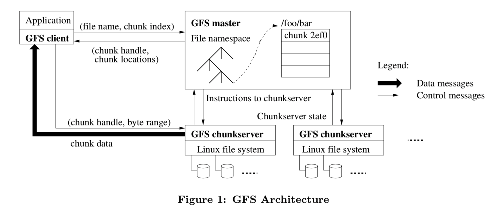

[The Google File System](./gfs.pdf)

**主要章节的翻译**

- [摘要](#摘要)
- [介绍](#1-介绍)
- [设计概览](#2-设计概览)
	- [假设](#21-假设)
	- [接口](#22-接口)
	- [架构](#23-架构)
	- [单点Master](#24-单点Master)
	- [块尺寸](#25-块尺寸)
	- [元数据](#26-元数据)
		- [内存中数据结构](#261-内存中数据结构)

## 摘要

&emsp;&emsp;我们已经设计和实现了Google File System，一个适用于大规模分布式数据处理相关应用的，可扩展的分布式文件系统。它基于普通的不算昂贵的硬件设备，实现了容错的设计，并且为大量客户端提供极高的聚合处理性能。 

&emsp;&emsp;我们的设计目标和上一个版本的分布式文件系统有很多相同的地方，我们的设计是依据我们应用的工作量以及技术环境来设计的，包括现在和预期的，都有一部分和早先的文件系统的约定有所不同。这就要求我们重新审视传统的设计选择，以及探索究极的设计要点。 

&emsp;&emsp;这个文件系统正好与我们的存储要求相匹配。这个文件系统在Google内部广泛应用于作为存储平台使用，适用于我们的服务要求产生和处理数据应用，以及我们的研发要求的海量数据的要求。最大的集群通过上千个计算机的数千个硬盘，提供了数百TB的存储，并且这些数据被数百个客户端并行同时操作。 

&emsp;&emsp;在这个论文里，我们展示了用于支持分布式应用的扩展文件系统接口设计，讨论了许多我们设计的方面，并且列出了我们的micro-benchmarks以及真实应用性能指标。

## 1 介绍

&emsp;&emsp;我们已经为Google迅速增长的数据处理需要而设计和实现了Google File System(GFS)。GFS和上一个分布式文件系统有着很多相同的设计目标，比如性能，扩展性，可靠性，以及可用性。不过，他的设计是基于我们应用的工作量和技术环境驱动的，包括现在和预期的，都有部分和上一个版本的约定有点不同。这就要求我们重新审视传统的设计选择，以及探索究极的设计要点。

- 首先，节点失效将被看成是正常情况，而不再视为异常情况。整个文件系统包含了几百个或者几千个由廉价的普通机器组成的存储机器，而且这些机器是被与之匹配数量的客户端机器访问。这些节点的质量和数量都实际上都确定了在任意给定时间上，一定有一些会处于失效状态，并且某一些并不会从当前失效中恢复回来。这有可能由于程序的bug，操作系统的bug，人工操作的失误，以及硬盘坏掉，内存，网络，插板的损坏，电源的坏掉等等。因此，持续监视，错误检测，容错处理，自动恢复必须集成到这个文件系统的设计中来。

- 其次，按照传统标准来看，文件都是非常巨大的。数个GB的文件是常事。每一个文件都包含了很多应用程序对象，比如web文档等等。当我们通常操作迅速增长的，由很多TB组成的，包含数十亿对象的数据集，我们可不希望管理数十亿个KB大小的文件，即使文件系统能支持也不希望。所以，设计约定和设计参数比如I/O操作以及blocksize（块大小），都需要重新审查。

- 第三，大部分文件都是只会在文件尾新增加数据，而少见修改已有数据的。对一个文件的随机写操作在实际上几乎是不存在的。当一旦写完，文件就是只读的，并且一般都是顺序读取得。多种数据都是有这样的特性的。有些数据可能组成很大的数据仓库，并且数据分析程序从头扫描到尾。有些可能是运行应用而不断的产生的数据流。有些是归档的数据。有些是一个机器为另一个机器产生的中间结果，另一个机器及时或者随后处理这些中间结果。对于这些巨型文件的访问模式来说，增加模式是最重要的，所以我们首要优化性能的以及原子操作保证的就是它，而在客户端cache数据块没有什么价值。

- 第四，与应用一起设计的的文件系统API对于增加整个系统的弹性适用性有很大的好处。例如我们放松了GFS一致性模型的需求，从而我们不用部署复杂的应用系统就可以把GFS应用到大量的简单文件系统基础上。我们也引入了原子的增加操作，这样可以让多个客户端同时操作一个文件，而不需要他们之间有额外的同步操作。这些在本论文的后边章节有描述。 
多个GFS集群现在是作为不同应用目的部署的。最大的一个有超过1000个存储节点，超过300TB的硬盘存储，并且负担了持续沉重的上百个在不同机器上的客户端的访问。

## 2 设计概览

### 2.1 假设

&emsp;&emsp;设计GFS过程中我们做了很多的设计假设，它们既意味着挑战，也带来了机遇。我们早先提到的关于观测到的关键要点，现在我们详细描述下这些假设。

- 系统是构建在很多廉价的、普通的计算机上，这些计算机经常故障。它必须不间断监控自己、侦测错误，能够容错和快速恢复。

- 系统存储了大量的超大文件。我们预期有好几百万个文件，每一个超过100MB。数GB的文件经常出现并且应当对大文件进行有效的管理。同时必须支持小型文件，但是我们不必为小型文件进行特别的优化。

- 一般的工作量都是由两类读取组成：大的流式读取和小规模的随机读取。在大的流式读取中，每个读操作通常要读取几百k的数据，读取1M或者以上的数据也很常见。相同客户端发起的连续操作通常是在一个文件读取一个连续的范围。小规模的随机读取通常在文件的不同位置，读取几k数据。重视性能的应用程序通常会将它们的小型读批量打包、组织排序，能显著的提升性能。

- 工作量也来自对大型的、连续的写操作，即将数据append到文件。append数据的大小与一次读操作差不多。一旦完成写入，文件就很少会更改。对于文件的随机小规模写入是要被支持的，但是不需要为此作特别的优化。

- 系统必须非常有效的，明确细节的对多客户端并行添加同一个文件进行支持。我们的文件经常使用生产者/消费者队列模式，或者作为多路合并模式进行操作。几百个机器运行的制造者，将并发的append到一个文件。用最小的同步代价实现原子性是关键所在。文件被append时也可能出现并发的读。

- 高性能的稳定带宽的网络要比低延时更加重要。我们的目标应用程序一般会大量操作处理比较大块的数据，并且很少有应用要求某个读取或者写入要有一个很短的响应时间。

### 2.2 接口

&emsp;&emsp;GFS提供了常见的文件系统的接口，虽然他没有实现一些标准的API比如POSIX。文件是通过pathname来通过目录进行分层管理的。我们支持的一些常见操作：create,delete,open,close,read，write等文件操作。 
&emsp;&emsp;另外，GFS还提供snapshot和record append操作。snapshot可以用很低的花费为一个文件或者整个目录树创建一个副本。record append允许多个客户端并发的append数据到同一个文件，而且保证它们的原子性。这对于实现多路合并、生产者/消费者队列非常有用，大量的客户端能同时的append，也不用要考虑锁等同步问题。这种文件对于构造大型分布式应用来说，是不可或缺的。snapshot 和record append在后边的3.4 和3.3节有单独讲述。

### 2.3 架构

&emsp;&emsp;一个GFS集群包含单个master和多个chunkserver，被多个客户端访问，如图1所示。图中各组件都是某台普通Linux机器上运行在用户级别的一个进程。只要机器资源允许，并且允许不稳定的应用代码导致的低可靠性，我们就可以运行chunkserver和client可以运行在同一个机器上。 

&emsp;&emsp;在GFS下，每一个文件都拆成固定大小的chunk(块)。每一个块都由master根据块创建的时间产生一个全局唯一的以后不会改变的64位的chunk handle标志。chunkservers在本地磁盘上用Linux文件系统保存这些块，并且根据chunk handle和字节区间，通过linux文件系统读写这些块的数据。出于可靠性的考虑，每一个块都会在不同的chunkserver上保存备份。缺省情况下，我们保存3个备份，用户能为不同命名空间的文件配置不同的复制级别。

&emsp;&emsp;master负责管理所有的文件系统的元数据。包括namespace，访问控制信息，文件到chunk的映射关系，当前chunk的位置等等信息。master也同样控制系统级别的活动，比如chunk的分配管理，孤点chunk的垃圾回收机制，以及chunkserver之间的chunk迁移。master和这些chunkserver之间会有定期的心跳线进行通讯，并且心跳线传递信息和chunckserver的状态。 

&emsp;&emsp;每个应用程序会引用GFS的客户端API，此API与正规文件系统API相似，并且负责与master和chunkserver通讯，基于应用的行为来读写数据。客户端只在获取元数据时与master交互，真实的数据操作会直接发至chunkserver。我们并没有提供POSIX API并且不需要和Linux的vnode层相关。 

&emsp;&emsp;客户端或者chunkserver都不会cache文件数据。客户端缓存文件数据收益很小，这是因为大部分的应用都是流式访问超大文件或者操作的数据集太大而不能被chache。不设计cache系统使得客户端以及整个系统都大大简化了（少了cache的同步机制）(但是客户端会缓存元数据。)。chunkserver不需要cache文件数据，因为chunks就像本地文件一样的被保存，所以Linux的buffer cache已经把常用的数据cache到了内存里。

### 2.4 单点Master

&emsp;&emsp;单一master大大的简化了我们的设计，单一master能够放心使用全局策略执行复杂的chunk布置、制定复制决策等。然而，我们必须在读写过程中尽量减少对它的依赖，它才不会成为一个瓶颈。客户端从不通过master读写文件，它只会询问master自己应该访问哪个chunkserver。客户端会缓存这个信息一段时间，随后的很多操作即可以复用此缓存，与chunkserver直接交互。

&emsp;&emsp;我们利用图1来展示一个简单读操作的交互过程。首先，使用固定的chunk size，客户端将应用程序指定的文件名和字节偏移量翻译为一个GFS文件及内部chunk序号，随后将它们作为参数，发送请求到master。master找到对应的chunk句柄和副本位置，回复给客户端。客户端缓存这些信息，使用GFS文件名+chunk序号作为key。

&emsp;&emsp;于是这个客户端就像对应的位置的chunkserver发起请求，通常这个会是离这个客户端最近的一个。请求给定了chunk handle以及一个在这个chunk内需要读取得字节区间。在这个chunk内，再次操作数据将不用再通过客户端与master的交互，除非这个客户端本身的cache信息过期了，或者这个文件重新打开了。实际上，客户端通常都会在请求中附加向master询问多个chunk的信息，master于是接着会立刻给这个客户端回应这些chunk的信息。这个附加信息是通过几个几乎没有任何代价的客户端与master的交互完成的。

### 2.5 块尺寸

&emsp;&emsp;chunk的大小是一个设计的关键参数。我们选择这个大小为64M，远远大于典型的文件系统的block大小。每一个chunk的实例（复制品）都是作为在chunkserver上的Linux文件格式存放的，并且只有当需要的情况下才会增长。懒惰的空间分配避免了内部碎片导致的空间浪费，chunk size越大，碎片的威胁就越大。

&emsp;&emsp;chunk size较大时可以提供几种重要的优势。首先，它减少了客户端与master的交互，因为对同一个chunk的读写仅需要对master执行一次初始请求以获取chunk位置信息。在我们的应用场景中大部分应用会顺序的读写大型文件，chunk size较大（chunk数量就较少）能有效的降低与master的交互次数。即使是对小范围的随机读，客户端可以很容易cache一个好几个TB数据文件的所有的位置信息。其次，既然用户面对的是较大的chunk，它更可能愿意在同一个大chunk上执行很多的操作（而不是操作非常多的小chunk），这样就可以对同一个chunkserver保持长期的TCP连接以降低网络负载。第三，它减少了master上元数据的大小，这允许我们放心的在内存缓存元数据，章节2.6.1会讨论继而带来的各种好处。

&emsp;&emsp;不过chunk size如果很大，即使使用懒惰的空间分配，也有它的缺点。一个小文件包含chunk数量较少，可能只有一个。在chunkserver上这些chunk可能变成热点，因为很多客户端会访问相同的文件。不过实际上热点没有导致太多问题，因为我们的应用大部分都是连续的读取很大的文件，包含很多chunk。

&emsp;&emsp;然而，热点确实曾经导致过问题，当GFS最初被用在 batch-queue system：用户将一个可执行程序写入GFS，它只占一个chunk，然后几百台机器同时启动，请求此可执行程序。只有两三个chunkserver保存这个可执行的文件，但是有好几百台机器一起请求加载这个文件导致系统局部过载。我们通过提高它的复制级别解决了这个问题（更多冗余，分担压力），并且建议该系统交错安排启动时间。一个潜在的长期解决方案是允许客户端从其他客户端读取数据（P2P模式）。

### 2.6 元数据

#### 2.6.1 内存中数据结构