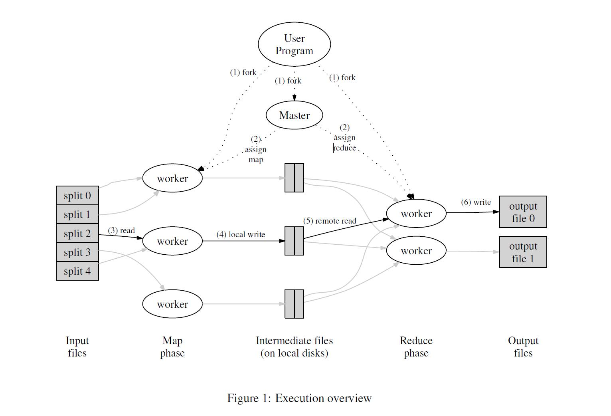

[MapReduce: 大型集群上的简化数据处理](./mapreduce.pdf)

- [摘要](#摘要)
- [介绍](#1-介绍)
- [编程模型](#2-编程模型)
	- [例子](#21-例子)
	- [类型](#22-类型)
	- [更多例子](#23-更多例子)
- [实现](#3-实现)
	- [执行综述](#31-执行综述)
	- [Master数据结构](#32-Master数据结构)

## 摘要

&emsp;&emsp;MapReduce 是一个编程模型，也是一个处理和生成超大数据集的算法模型的相关实现。用
户首先创建一个 Map 函数处理一个基于 key/value pair 的数据集合，输出中间的基于 key/value pair 的数据集合；然后再创建一个 Reduce 函数用来合并所有的具有相同中间 key 值的中间 value 值。现实世界中有很多满足上述处理模型的例子，本论文将详细描述这个模型。

&emsp;&emsp;MapReduce 架构的程序能够在大量的普通配置的计算机上实现并行化处理。这个系统在运行时只关心：如何分割输入数据，在大量计算机组成的集群上的调度，集群中计算机的错误处理，管理集群中计算机之间必要的通信。采用 MapReduce 架构可以使那些没有并行计算和分布式处理系统开发经验的程序员有效利用分
布式系统的丰富资源。

&emsp;&emsp;我们的 MapReduce 实现运行在规模可以灵活调整的由普通机器组成的集群上：一个典型的 MapReduce 计算往往由几千台机器组成、处理以 TB 计算的数据。程序员发现这个系统非常好用：已经实现了数以百计的 MapReduce 程序，在 Google 的集群上，每天都有 1000 多个 MapReduce 程序在执行。

## 1 介绍

&emsp;&emsp;在过去的 5 年里，包括本文作者在内的 Google 的很多程序员，为了处理海量的原始数据，已经实现了数以百计的、专用的计算方法。这些计算方法用来处理大量的原始数据，比如，文档抓取（类似网络爬虫的程
序）、Web 请求日志等等；也为了计算处理各种类型的衍生数据，比如倒排索引、Web 文档的图结构的各种表示形势、每台主机上网络爬虫抓取的页面数量的汇总、每天被请求的最多的查询的集合等等。大多数这样的数据处理运算在概念上很容易理解。然而由于输入的数据量巨大，因此要想在可接受的时间内完成运算，只有将这些计算分布在成百上千的主机上。如何处理并行计算、如何分发数据、如何处理错误？所有这些问题综合在一起，需要大量的代码处理，因此也使得原本简单的运算变得难以处理。

&emsp;&emsp;为了解决上述复杂的问题，我们设计一个新的抽象模型，使用这个抽象模型，我们只要表述我们想要执行的简单运算即可，而不必关心并行计算、容错、数据分布、负载均衡等复杂的细节，这些问题都被封装在了一个库里面。设计这个抽象模型的灵感来自 Lisp 和许多其他函数式语言的 Map 和 Reduce 的原语。我们意识到我们大多数的运算都包含这样的操作：在输入数据的“逻辑”记录上应用 Map 操作得出一个中间 key/valuepair 集合，然后在所有具有相同 key 值的 value 值上应用 Reduce 操作，从而达到合并中间的数据，得到一个想要的结果的目的。使用 MapReduce 模型，再结合用户实现的 Map 和 Reduce 函数，我们就可以非常容易的实现大规模并行化计算；通过 MapReduce 模型自带的“再次执行”（re-execution）功能，也提供了初级的容灾实现方案。

&emsp;&emsp;这个工作(实现一个 MapReduce 框架模型)的主要贡献是通过简单的接口来实现自动的并行化和大规模的分布式计算，通过使用 MapReduce 模型接口实现在大量普通的 PC 机上高性能计算。

&emsp;&emsp;第二部分描述基本的编程模型和一些使用案例。

&emsp;&emsp;第三部分描述了一个经过裁剪的、适合我们的基于集群的计算环境的 MapReduce 实现。

&emsp;&emsp;第四部分描述我们认为在 MapReduce 编程模型中一些实用的技巧。

&emsp;&emsp;第五部分对于各种不同的任务，测量我们 MapReduce 实现的性能。

&emsp;&emsp;第六部分揭示了在 Google 内部如何使用 MapReduce 作为基础重写我们的索引系统产品，包括其它一些使用 MapReduce 的经验。

&emsp;&emsp;第七部分讨论相关的和未来的工作。

## 2 编程模型

&emsp;&emsp;MapReduce 编程模型的原理是：利用一个输入 key/value pair 集合来产生一个输出的 key/value pair 集合。使用MapReduce 库的用户需要传递两个计算相关的函数：Map 和 Reduce。

&emsp;&emsp;用户自定义的 Map 函数接受一个输入的 key/value pair 值，然后产生一个中间 key/value pair 值的集合。MapReduce 库把所有具有相同中间 key 值 I 的中间 value 值集合在一起后传递给 reduce 函数。

&emsp;&emsp;用户自定义的 Reduce 函数接受一个中间 key 的值 I 和相关的一个 value 值的集合。Reduce 函数合并这些value 值，形成一个较小的 value 值的集合。一般的，每次 Reduce 函数调用只产生 0 或 1 个输出 value 值。通常我们通过一个迭代器把中间 value 值提供给 Reduce 函数，这样我们就可以处理无法全部放入内存中的大量的 value 值的集合。

### 2.1 例子

&emsp;&emsp;例如，计算一个大的文档集合中每个单词出现的次数，下面是伪代码：

```
map(String key, String value):
	// key: document name
	// value: document contents
	for each word w in value:
		EmitIntermediate(w, "1");

reduce(String key, Iterator values):
	// key: a word
	// values: a list of counts
	int result = 0;
	for each v in values:
		result += ParseInt(v);
	Emit(AsString(result));
```
&emsp;&emsp;Map 函数输出文档中的每个词、以及这个词的出现次数(在这个简单的例子里就是 1)。Reduce 函数把 Map 函数产生的每一个特定的词的计数累加起来。

&emsp;&emsp;另外，用户编写代码，使用输入和输出文件的名字、可选的调节参数来完成一个符合 MapReduce 模型规范的对象，然后调用 MapReduce 函数，并把这个规范对象传递给它。用户的代码和 MapReduce 库链接在一起(用 C++实现)。附录 A 包含了这个实例的全部程序代码。

### 2.2 类型

&emsp;&emsp;尽管在前面例子的伪代码中使用了以字符串表示的输入输出值，但是在概念上，用户定义的 Map 和 Reduce 函数都有相关联的类型：

```
map 	(k1,v1) 		--> list(k2,v2)
reduce 	(k2,list(v2)) 	--> list(v2)
```

&emsp;&emsp;也就是说，输入的 key 和 value 值与输出的 key 和 value 值在类型上推导的域不同。此外，中间 key 和 value 值与输出 key 和 value 值在类型上推导的域相同。

&emsp;&emsp;我们的 C++中使用字符串类型作为用户自定义函数的输入输出，用户在自己的代码中对字符串进行适当的类型转换。

### 2.3 更多例子

&emsp;&emsp;这里还有一些有趣的简单例子，可以很容易的使用 MapReduce 模型来表示：

&emsp;&emsp;分布式的 Grep：Map 函数输出匹配某个模式的一行，Reduce 函数是一个恒等函数，即把中间数据复制到输出。

&emsp;&emsp;计算 URL 访问频率：Map 函数处理日志中 web 页面请求的记录，然后输出(URL,1)。Reduce 函数把相同 URL 的 value 值都累加起来，产生(URL,记录总数)结果。

&emsp;&emsp;倒转网络链接图：Map 函数在源页面（source）中搜索所有的链接目标（target）并输出为(target,source)。Reduce 函数把给定链接目标（target）的链接组合成一个列表，输出(target,list(source))。

&emsp;&emsp;每个主机的检索词向量：检索词向量用一个(词,频率)列表来概述出现在文档或文档集中的最重要的一些词。Map 函数为每一个输入文档输出(主机名,检索词向量)，其中主机名来自文档的 URL。Reduce 函数接收给定主机的所有文档的检索词向量，并把这些检索词向量加在一起，丢弃掉低频的检索词，输出一个最终的(主
机名,检索词向量)。

&emsp;&emsp;倒排索引：Map 函数分析每个文档输出一个(词,文档号)的列表，Reduce 函数的输入是一个给定词的所有（词，文档号），排序所有的文档号，输出(词,list（文档号）)。所有的输出集合形成一个简单的倒排索引，它以一种简单的算法跟踪词在文档中的位置。

&emsp;&emsp;分布式排序：Map 函数从每个记录提取 key，输出(key,record)。Reduce 函数不改变任何的值。这个运算依赖分区机制(在 4.1 描述)和排序属性(在 4.2 描述)。

## 3 实现

&emsp;&emsp;MapReduce 模型可以有多种不同的实现方式。如何正确选择取决于具体的环境。例如，一种实现方式适用于小型的共享内存方式的机器，另外一种实现方式则适用于大型 NUMA 架构的多处理器的主机，而有的实现方式更适合大型的网络连接集群。

&emsp;&emsp;本章节描述一个适用于 Google 内部广泛使用的运算环境的实现：用以太网交换机连接、由普通 PC 机组成的大型集群。在我们的环境里包括：

1. x86 架构、运行 Linux 操作系统、双处理器、2-4GB 内存的机器。

2. 普通的网络硬件设备，每个机器的带宽为百兆或者千兆，但是远小于网络的平均带宽的一半。

3. 集群中包含成百上千的机器，因此，机器故障是常态。

4. 存储为廉价的内置 IDE 硬盘。一个内部分布式文件系统用来管理存储在这些磁盘上的数据。文件系统通过数据复制来在不可靠的硬件上保证数据的可靠性和有效性。

5. 用户提交工作（job）给调度系统。每个工作（job）都包含一系列的任务（task），调度系统将这些任务调度到集群中多台可用的机器上。

### 3.1 执行综述

&emsp;&emsp;通过将 Map 调用的输入数据自动分割为 M 个数据片段的集合，Map 调用被分布到多台机器上执行。输入的数据片段能够在不同的机器上并行处理。使用分区函数将 Map 调用产生的中间 key 值分成 R 个不同分区（例如，hash(key) mod R），Reduce 调用也被分布到多台机器上执行。分区数量（R）和分区函数由用户来指定。



&emsp;&emsp;图 1 展示了我们的 MapReduce 实现中操作的全部流程。当用户调用 MapReduce 函数时，将发生下面的一系列动作（下面的序号和图 1 中的序号一一对应）：

1. 用户程序首先调用的 MapReduce 库将输入文件分成 M 个数据片度，每个数据片段的大小一般从 16MB 到 64MB(可以通过可选的参数来控制每个数据片段的大小)。然后用户程序在机群中创建大量的程序副本。

2. 这些程序副本中的有一个特殊的程序 master。副本中其它的程序都是 worker 程序，由 master 分配任务。有 M 个 Map 任务和 R 个 Reduce 任务将被分配，master 将一个 Map 任务或 Reduce 任务分配给一个空闲的 worker。

3. 被分配了 map 任务的 worker 程序读取相关的输入数据片段，从输入的数据片段中解析出 key/value pair，然后把 key/value pair 传递给用户自定义的 Map 函数，由 Map 函数生成并输出的中间 key/value pair，并缓存在内存中。

4. 缓存中的 key/value pair 通过分区函数分成 R 个区域，之后周期性的写入到本地磁盘上。缓存的 key/value pair 在本地磁盘上的存储位置将被回传给 master，由 master 负责把这些存储位置再传送给 Reduce worker。

5. 当 Reduce worker 程序接收到 master 程序发来的数据存储位置信息后，使用 RPC 从 Map worker 所在主机的磁盘上读取这些缓存数据。当 Reduce worker 读取了所有的中间数据后，通过对 key 进行排序后使得具有相同 key 值的数据聚合在一起。由于许多不同的 key 值会映射到相同的 Reduce 任务上，
因此必须进行排序。如果中间数据太大无法在内存中完成排序，那么就要在外部进行排序。

6. Reduce worker 程序遍历排序后的中间数据，对于每一个唯一的中间 key 值，Reduce worker 程序将这个 key 值和它相关的中间 value 值的集合传递给用户自定义的 Reduce 函数。Reduce 函数的输出被追加到所属分区的输出文件。

7. 当所有的 Map 和 Reduce 任务都完成之后，master 唤醒用户程序。在这个时候，在用户程序里的对 MapReduce 调用才返回。

&emsp;&emsp;在成功完成任务之后，MapReduce 的输出存放在 R 个输出文件中（对应每个 Reduce 任务产生一个输出文件，文件名由用户指定）。一般情况下，用户不需要将这 R 个输出文件合并成一个文件——他们经常把这些文件作为另外一个 MapReduce 的输入，或者在另外一个可以处理多个分割文件的分布式应用中使用。

### 3.2 Master数据结构